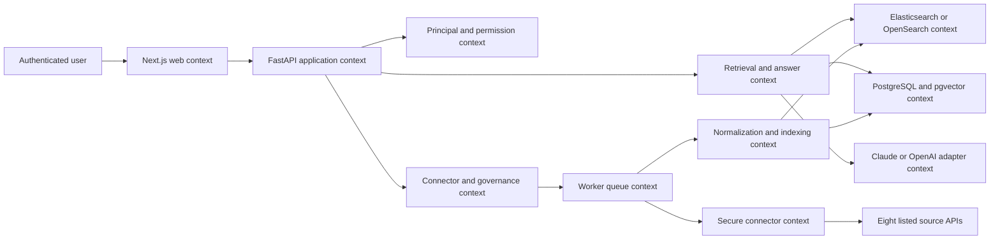
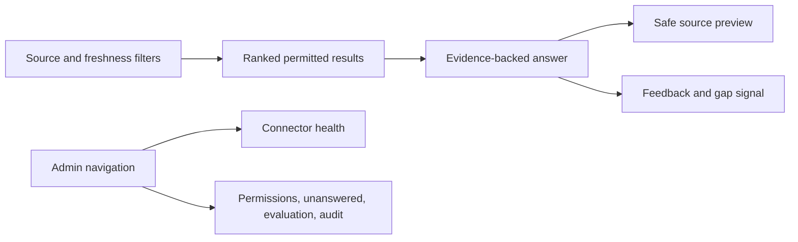

# Permission-Aware Internal Knowledge Assistant

## Header

| Field | Value |
|---|---|
| Product | Permission-Aware Internal Knowledge Assistant |
| One-line pitch | Permission-aware search and Q&A across company knowledge sources for distributed and regulated teams. |
| Status | Greenfield |
| Date | 2026-08-04 |
| Author | OpenCode |
| Build window | 5 to 8 weeks [verified from Project list.md, section 2] |
| UI | Yes |
| Product source | `D:\ARC Automation Service\Project list.md`, section 2 |
| Team size | Not specified; do not infer |
| Budget | Not specified; do not infer |
| External deadline | Not specified; do not infer |

### Evidence Rules

| Label | Meaning in this document |
|---|---|
| `[verified]` | Explicitly stated by the supplied project description or user input |
| `[inferred]` | A proposed implementation, acceptance target, workflow, or directory detail needed to make the product buildable |
| `[uncertain]` | A capability, version, benchmark, or citation not established by the supplied source |

| Rule | Application |
|---|---|
| Source boundary | Product decisions use only section 2 of `Project list.md` plus the supplied inputs. |
| No invented business facts | No team size, budget, customer deadline, deployment scale, or commercial commitment is assumed. |
| No unmarked implementation facts | Architecture, directory layout, API behavior, latency targets, and connector coverage below are proposed and marked `[inferred]`. |
| No external claims | No external vendor documentation, versions, benchmarks, or citations are treated as verified. |
| Unknown connector behavior | Authentication scopes, webhook availability, rate limits, export formats, and ACL fidelity are `[uncertain]` until tested against each listed API. |
| Decision default | When an implementation choice is necessary, use the smallest reversible choice that preserves permission safety. `[inferred]` |

## Project Summary

| Item | Definition |
|---|---|
| Core job | Let an authenticated employee find and understand permitted company knowledge across fragmented sources without exposing restricted content. `[inferred]` |
| Primary output | A ranked result set or a concise answer with source citations, access-safe previews, freshness information, and an auditable access record. `[inferred]` |
| Buyer context | Companies with 30 or more employees, distributed teams, support organizations, consulting firms, regulated businesses, and businesses with fragmented documentation. `[verified]` |
| Knowledge sources | Google Drive, SharePoint, Slack, Teams, Notion, Confluence, Jira, and GitHub. `[verified]` |
| Knowledge modes | Hybrid search, cited Q&A, policy Q&A, onboarding assistance, role-specific results, freshness visibility, feedback, search analytics, and unanswered-question reporting. `[verified]` |
| Security premise | A source item must not affect a user-visible result or answer unless the user is authorized for that item at request time. `[inferred]` |
| MVP boundary | Next.js, FastAPI, PostgreSQL with pgvector, Elasticsearch or OpenSearch, worker queues, and secure connector services; listed APIs are the integration boundary. `[verified]` |
| AI boundary | Hybrid retrieval, reranking, metadata filters, permission checks, Claude or OpenAI, citations, query rewriting, and evaluation datasets. `[verified]` |

Permission-Aware Internal Knowledge Assistant is a read-only search and Q&A surface for company knowledge that preserves source permissions, returns citations, and makes freshness and access state visible. `[inferred from verified product scope]`

The MVP is bounded by Next.js, FastAPI, PostgreSQL with pgvector, Elasticsearch or OpenSearch, worker queues, secure connector services, and the eight listed source APIs. It is sized for the verified 5–8 week window without assuming team size, budget, or external deadline.

## Table of Contents

1. [Header](#header)
2. [Project Summary](#project-summary)
3. [Table of Contents](#table-of-contents)
4. [Product Overview](#product-overview)
5. [Technology Stack](#technology-stack)
6. [System Architecture](#system-architecture)
7. [Core Design: Permission-Aware Ingestion and Retrieval](#core-design-permission-aware-ingestion-and-retrieval)
8. [Design System](#design-system)
9. [Build Plan](#build-plan)
10. [Open Decisions & Future Scope](#open-decisions--future-scope)
11. [Appendix: References](#appendix-references)

## Product Overview

### Concrete Failure Modes

- A deleted or updated policy remains searchable because ingestion only adds vectors and does not reconcile lifecycle state. `[inferred from verified update/deletion requirement]`
- A restricted result is returned because ACLs are applied in the browser or after model context is assembled. `[inferred]`
- An answer sounds authoritative but has no direct source reference or cites a source the requester cannot open. `[inferred from verified cited-answer requirement]`
- A connector fails silently, leaving users unable to distinguish current knowledge from stale indexed content. `[inferred from verified connector-status/freshness requirement]`

> “Employees waste time searching across Drive, Slack, Notion, SharePoint, CRM records, tickets, and internal documentation.” `[verified, Project list.md section 2]`

> “Average implementations dump PDFs into a vector database.” `[verified, Project list.md section 2]`

| Observed problem | Product implication |
|---|---|
| Employees waste time searching Drive, Slack, Notion, SharePoint, CRM records, tickets, and internal documentation. `[verified]` | One search surface must normalize heterogeneous sources without flattening their access rules. `[inferred]` |
| Average implementations dump PDFs into a vector database. `[verified]` | Ingestion must preserve updates, deletions, permissions, and source identity. `[inferred]` |
| Fragmented documentation creates onboarding and policy lookup friction. `[verified]` | The first demo must show a policy answer scoped to region and role with a direct approval form citation. `[inferred from verified demo scenario]` |
| Regulated and distributed teams require visible control. `[verified audience/context]` | The UI must expose access restrictions, source freshness, connector health, citations, and audit events. `[inferred from verified premium presentation]` |

| Opportunity hypothesis | Testable product expression |
|---|---|
| Permission-safe answers are more valuable than generic chatbot answers. `[inferred]` | Compare answer citation coverage and unauthorized-content tests in the evaluation report. |
| Cross-source retrieval reduces context switching. `[inferred]` | Run the same seeded question across at least two sources and show one ranked, cited result set. |
| Visible gaps create governance value. `[inferred from unanswered-question reporting]` | Admins can inspect unanswered and low-confidence queries without seeing content they cannot access. |

### Success Metrics

| Metric class | Metric | MVP target | Observable evidence |
|---|---|---|---|
| Numeric | Permission leakage | `0` unauthorized items, snippets, embeddings, or citations in adversarial tests. `[inferred target]` | Automated cross-principal and cross-tenant tests. |
| Numeric | Citation coverage | At least `95%` of labeled answer claims have valid supporting citations. `[inferred target]` | Citation validator report. |
| Numeric | Search latency | `p95 <= 2.5 seconds` in the seeded evaluation environment. `[inferred target]` | API timing record. |
| Numeric | Deletion and permission propagation | At least `95%` of test changes are safe within `15 minutes`; request-time recheck denies earlier. `[inferred target]` | Change-to-denial/removal test record. |
| Numeric | Source boundary coverage | `8 of 8` listed connectors show health, sync, error, and lifecycle states. `[inferred target]` | Connector contract and UI tests. |
| Qualitative (only) | Evidence trust behavior | In a fixed seeded review, reviewers can verify the travel-policy answer from its citations. `[inferred observable behavior]` | Structured review notes for the seeded policy scenario. |

### Goals And Non-Goals

#### Goals

| ID | Goal | Evidence of completion |
|---|---|---|
| G-01 | Search permitted knowledge across all eight listed source systems. `[inferred MVP interpretation]` | Each connector has a sync status, normalized item contract, and at least one indexed fixture or API-backed test. |
| G-02 | Return citations that identify the source item and location used by an answer. | Every answer claim in the acceptance dataset maps to one or more permitted citations. |
| G-03 | Enforce permissions before display and before answer generation. | Deny-by-default tests pass; unauthorized items produce no snippets, citations, embeddings, or answer text. |
| G-04 | Handle source updates and deletions. | A changed item is reindexed and a deleted item becomes unsearchable within the defined target window. |
| G-05 | Make freshness, connector status, access restrictions, and knowledge gaps visible. | Search, source preview, admin connector, permission, and unanswered-query views are demoable. |
| G-06 | Produce auditable query and connector events. | An admin can inspect who accessed what source reference, when, and through which action. |
| G-07 | Provide a repeatable evaluation path. | An evaluation dataset records retrieval, permission, citation, and answer outcomes. |

#### Non-Goals

| ID | Explicitly out of scope for this MVP |
|---|---|
| NG-01 | Autonomous workflow execution, ticket edits, code changes, approvals, or write actions in connected systems. |
| NG-02 | A general-purpose enterprise identity provider integration not listed in the source. `[inferred scope control]` |
| NG-03 | Native mobile applications. Responsive web behavior is required; a separate mobile app is not. `[inferred]` |
| NG-04 | Training a foundation model or building a proprietary embedding model. |
| NG-05 | Guaranteed support for every source object type, attachment type, ACL nuance, or API quota. Those capabilities are `[uncertain]` until connector tests establish them. |
| NG-06 | Automated policy interpretation, legal advice, compliance certification, or regulatory decisions. |
| NG-07 | Bulk migration, source-of-truth replacement, document authoring, or enterprise content lifecycle management. |
| NG-08 | A public consumer search experience or anonymous access. |
| NG-09 | Commercial pricing, seat limits, deployment scale, or SLA commitments. |

### Functional Requirements

#### Search

| ID | Requirement | Priority |
|---|---|---|
| SRCH-01 | Accept a natural-language query and optional source, content-type, freshness, and role/region filters. `[inferred]` | Must |
| SRCH-02 | Search lexical and vector representations through Elasticsearch or OpenSearch plus pgvector-backed metadata. `[inferred architecture]` | Must |
| SRCH-03 | Apply tenant and permission filters during retrieval, not only in the browser or after answer generation. | Must |
| SRCH-04 | Return ranked results with title, source, location, update time, access-safe snippet, and result reason. | Must |
| SRCH-05 | Hide snippets and metadata for denied or unresolved items. | Must |
| SRCH-06 | Support query rewriting only when the original query and rewritten terms remain auditable. `[inferred]` | Should |
| SRCH-07 | Show an explicit no-access-safe state when no authorized context remains. | Must |
| SRCH-08 | Preserve a stable result/citation identifier across answer and source preview requests. | Must |

#### Q&A

| ID | Requirement | Priority |
|---|---|---|
| QA-01 | Generate answers only from authorized retrieved context. | Must |
| QA-02 | Attach one or more citations to each answer claim or return a refusal when citation coverage fails. | Must |
| QA-03 | State when the indexed knowledge is insufficient rather than filling gaps with unsupported claims. | Must |
| QA-04 | Show source title, source system, location, indexed update time, and freshness state for every citation. | Must |
| QA-05 | Keep model provider choice between Claude or OpenAI configurable behind a server-side adapter. `[inferred]` | Should |
| QA-06 | Log model/provider identifier and prompt/response hashes or redacted content according to the audit policy. `[inferred]` | Must |
| QA-07 | Prevent direct model access from the browser. | Must |
| QA-08 | Allow the user to mark an answer helpful, not helpful, or incorrect and optionally provide a reason. | Must |

#### Source Preview

| ID | Requirement | Priority |
|---|---|---|
| PREV-01 | Open a source preview only after a fresh permission check. | Must |
| PREV-02 | Display source title, location, connector, excerpt, update time, and external deep link when available. | Must |
| PREV-03 | Redact or omit content if the source preview cannot be fetched safely. | Must |
| PREV-04 | Show whether the item is current, stale, deleted, or permission-revalidation pending. | Must |
| PREV-05 | Never use a preview endpoint as an ACL bypass for search or Q&A. | Must |

#### Connectors

| ID | Requirement | Priority |
|---|---|---|
| CON-01 | Provide a common connector interface for Google Drive, SharePoint, Slack, Teams, Notion, Confluence, Jira, and GitHub. | Must |
| CON-02 | Store connector credentials in a secure service boundary; application pages receive status, never raw credentials. | Must |
| CON-03 | Support initial sync, incremental sync where the source allows it, update detection, deletion detection, checkpointing, retries, and error reporting. | Must |
| CON-04 | Normalize source ACLs into opaque principals and groups before indexing. | Must |
| CON-05 | Show connector status, last successful sync, current run, error count, item count, and freshness. | Must |
| CON-06 | Make unsupported source object types explicit instead of silently dropping them. | Must |
| CON-07 | Isolate connector failures so one source cannot corrupt another source’s index. | Must |
| CON-08 | Record source API capability gaps as connector diagnostics. `[inferred]` | Should |

#### Governance And Analytics

| ID | Requirement | Priority |
|---|---|---|
| GOV-01 | Record query, retrieval, authorization, citation, feedback, sync, and deletion events. | Must |
| GOV-02 | Provide unanswered-question reporting based on no-result, no-authorized-context, low-citation, or negative-feedback outcomes. | Must |
| GOV-03 | Provide document freshness status and stale-item counts. | Must |
| GOV-04 | Provide evaluation runs with dataset version, query, expected source IDs, expected permission outcome, and actual result. | Must |
| GOV-05 | Keep analytics queries from exposing raw restricted source text to unauthorized admin users. | Must |

## Technology Stack

### Required Stack And Justification

| Technology or integration | Requirement-specific use | Status |
|---|---|---|
| Next.js | UI for search, cited answers, source preview, connector admin, permissions, unanswered queries, and evaluation reports. | `[verified stack]` |
| FastAPI | Server contract boundary for principal resolution, permission checks, retrieval, Q&A, connector status, and audit routes. | `[verified stack; API boundary inferred]` |
| PostgreSQL with pgvector | Durable tenant, principal, ACL, source-item, chunk, query, answer, feedback, and audit metadata with vector representation. | `[verified stack; data model inferred]` |
| Elasticsearch or OpenSearch | Lexical, metadata, and candidate retrieval for hybrid search; the product choice is unresolved. | `[verified boundary; selection inferred]` |
| Worker queues | Isolate ingestion, chunking, embedding, indexing, deletion, sync retry, and evaluation work from request latency. | `[verified stack; job split inferred]` |
| Secure connector services | Keep source credentials and API calls outside the browser while normalizing content, ACLs, updates, and deletions. | `[verified stack; service boundary inferred]` |
| Claude or OpenAI | Server-side answer generation behind an adapter using only authorized retrieved context. | `[verified AI boundary; model/version uncertain]` |

### Integration Boundary

Google Drive, SharePoint, Slack, Teams, Notion, Confluence, Jira, and GitHub are the complete MVP source boundary. `[verified]` Source-specific object coverage, scopes, ACL inheritance, change feeds, quotas, and retention behavior remain `[uncertain]` until adapter tests establish them.

## System Architecture

All bounded contexts, communication steps, service responsibilities, and directory entries are proposed implementation details. `[inferred]`
### Bounded Contexts



### Request-To-Response Communication Flow

1. The Next.js web context sends `SearchRequest` or `AnswerRequest` with the authenticated principal context to FastAPI.
2. FastAPI resolves tenant and principal identity; missing or unknown identity becomes a safe denial. `[inferred]`
3. The retrieval context normalizes the query and obtains lexical/vector candidates from the search context and metadata store.
4. The policy context applies tenant, role/region, source, and ACL filters; `unknown` is deny.
5. FastAPI passes only authorized chunks and locators to the reranker and model adapter.
6. The answer context validates citations against the authorized context set and returns `AnswerResponse` or a safe refusal.
7. The web context renders answer, citations, freshness, feedback, and safe preview actions.
8. Query, decision, citation, answer, and feedback events are written to the audit store. `[inferred]`

### Proposed Directory Tree

The tree is implementation proposal, not verified existing context. `[inferred]`

```text
permission-assistant/                         # [inferred] repository root
  web/app/search/page.tsx                     # [inferred] search and answer route
  web/app/admin/connectors/page.tsx           # [inferred] connector status and sync route
  web/components/CitationChip.tsx             # [inferred] citation and freshness control
  web/components/ResultRow.tsx                # [inferred] access-safe result renderer
  api/routes/search.py                         # [inferred] search request contract
  api/routes/answers.py                        # [inferred] answer and citation contract
  api/routes/admin.py                          # [inferred] connector, audit, and evaluation routes
  api/policies/authorization.py                # [inferred] deny-by-default policy evaluator
  api/services/retrieval.py                    # [inferred] hybrid retrieval orchestration
  api/services/answers.py                      # [inferred] model adapter and citation validation
  connectors/base.py                           # [inferred] common connector interface
  connectors/adapters/                         # [inferred] eight source adapter implementations
  workers/sync.py                              # [inferred] sync, checkpoint, and retry jobs
  workers/index.py                             # [inferred] chunk, embedding, and index jobs
  db/migrations/                               # [inferred] PostgreSQL schema changes
  tests/security/test_permissions.py           # [inferred] denial and tenant-isolation tests
  tests/e2e/test_policy_trace.py               # [inferred] travel-policy end-to-end trace
```

### Service Responsibilities

| Context | Responsibility | Prohibited behavior |
|---|---|---|
| Next.js web | Render search, answers, previews, admin, analytics, and feedback. | Never enforce ACLs or hold connector secrets. |
| FastAPI application | Validate contracts, resolve principals, orchestrate retrieval/answers, and return safe errors. | Never trust client ACLs or result IDs without rechecking. |
| PostgreSQL and pgvector | Store tenant, principal, ACL, source, chunk, query, answer, feedback, and audit metadata. | Never be the only request-time permission check. |
| Search context | Perform lexical/vector candidate retrieval and metadata filtering. | Never expose a candidate before authorization. |
| Worker and connector contexts | Sync, normalize, checkpoint, retry, delete, and index source content and ACLs. | Never send raw credentials to web/API clients. |
| Model adapter | Generate structured, cited output from authorized context. | Never decide authorization or receive denied content. |

## Core Design: Permission-Aware Ingestion and Retrieval

### Data Model

The following persistence model is proposed for the MVP. `[inferred]`

| Entity | Required fields | Purpose |
|---|---|---|
| `tenant` | `tenant_id`, name, status | Isolate all records and index documents. |
| `principal` | `principal_id`, tenant, external key, email, status | Resolve the requesting identity. |
| `connector` | `connector_id`, tenant, source type, status, checkpoint | Own source sync state. |
| `source_item` | `item_id`, external ID, locator, hash, ACL version, lifecycle state | Represent normalized source content and lifecycle. |
| `source_acl` | item, subject type/key, read permission, version | Represent source access state. |
| `content_chunk` | item, ordinal, text hash, embedding, index state | Support lexical/vector retrieval and citation locators. |
| `query` | query ID, tenant, principal, query hash, timestamp | Track a user search without requiring raw text in operations logs. |
| `answer` | answer ID, query, status, provider key, timestamp | Track generated output and its safety status. |
| `citation` | answer, item, locator, coverage state | Resolve evidence only from authorized context. |
| `sync_run` | run ID, connector, mode, status, checkpoints, counts | Trace ingestion progress and failures. |

#### Persistence Rules

| Rule | Required behavior |
|---|---|
| Tenant isolation | Every content, ACL, query, index document, and audit event carries a tenant scope. `[inferred]` |
| Item identity | `(connector_id, external_id)` is unique within a tenant. `[inferred]` |
| Version identity | Content and ACL versions are stored independently so permission changes do not require content changes. `[inferred]` |
| Deletion | A tombstone is retained for sync reconciliation while content retrieval is disabled. `[inferred]` |
| Embedding safety | Embeddings are treated as restricted representations and are not exposed through client APIs. `[inferred]` |
| Search index | Index documents contain only fields required for ranking, filtering, citation, and safe preview. `[inferred]` |
| Audit retention | Retention duration is not specified by the source and must be configurable; no default duration is asserted. `[uncertain]` |

### Typed Contracts

#### Shared Types

```typescript
type UUID = string;
type ISODateTime = string;
type SourceType =
  | "google_drive"
  | "sharepoint"
  | "slack"
  | "teams"
  | "notion"
  | "confluence"
  | "jira"
  | "github";
type LifecycleState = "active" | "stale" | "deleted" | "pending_recheck";
type AccessDecision = "allow" | "deny" | "unknown";
type PermissionSubjectType = "principal" | "group" | "role";
type ConnectorStatus = "configured" | "running" | "healthy" | "degraded" | "failed" | "paused";
```

#### Principal Context

```typescript
interface PrincipalContext {
  tenantId: UUID;
  principalId: UUID;
  email: string;
  groupIds: UUID[];
  roleLabels: string[];
  regionLabels: string[];
  authIssuedAt: ISODateTime;
}
```

#### Search Request And Response

```typescript
interface SearchRequest {
  query: string;
  filters?: {
    sourceTypes?: SourceType[];
    updatedAfter?: ISODateTime;
    updatedBefore?: ISODateTime;
    roleLabels?: string[];
    regionLabels?: string[];
  };
  limit?: number;
  cursor?: string;
}

interface SearchResult {
  resultId: UUID;
  itemId: UUID;
  sourceType: SourceType;
  title: string;
  locator: string;
  safeSnippet?: string;
  sourceUpdatedAt?: ISODateTime;
  indexedAt: ISODateTime;
  lifecycleState: LifecycleState;
  score: number;
  access: "allowed";
}

interface SearchResponse {
  queryId: UUID;
  results: SearchResult[];
  nextCursor?: string;
  answerAvailable: boolean;
  noAccessibleContext: boolean;
  freshnessSummary: {
    freshCount: number;
    staleCount: number;
    unknownCount: number;
  };
}
```

#### Answer Request And Response

```typescript
interface AnswerRequest {
  queryId?: UUID;
  question: string;
  resultIds?: UUID[];
}

interface Citation {
  citationId: UUID;
  itemId: UUID;
  sourceType: SourceType;
  title: string;
  locator: string;
  sourceUpdatedAt?: ISODateTime;
  indexedAt: ISODateTime;
  coverageState: "supports" | "partial";
}

interface AnswerResponse {
  answerId: UUID;
  queryId: UUID;
  status: "answered" | "insufficient_context" | "refused" | "failed";
  answerText?: string;
  citations: Citation[];
  caveats: string[];
  freshness: "fresh" | "mixed" | "stale" | "unknown";
  generatedAt: ISODateTime;
}
```

#### Normalized Connector Item

```typescript
interface NormalizedSourceItem {
  tenantId: UUID;
  connectorId: UUID;
  sourceType: SourceType;
  externalId: string;
  parentExternalId?: string;
  title: string;
  body: string;
  canonicalUrl?: string;
  locator: string;
  contentType?: string;
  sourceCreatedAt?: ISODateTime;
  sourceUpdatedAt?: ISODateTime;
  contentHash: string;
  lifecycleState: "active" | "deleted";
  aclVersion: string;
  permissions: Array<{
    subjectType: PermissionSubjectType;
    subjectKey: string;
    permission: "read";
  }>;
  metadata: Record<string, string | number | boolean | string[]>;
}
```

#### Sync Events

```typescript
interface SyncRun {
  syncRunId: UUID;
  connectorId: UUID;
  mode: "initial" | "incremental" | "reconcile";
  status: "queued" | "running" | "completed" | "partial" | "failed";
  checkpointBefore?: string;
  checkpointAfter?: string;
  itemsSeen: number;
  itemsUpserted: number;
  itemsDeleted: number;
  itemsRejected: number;
  errorCount: number;
  startedAt?: ISODateTime;
  finishedAt?: ISODateTime;
}

interface SourceChangeEvent {
  eventId: UUID;
  syncRunId: UUID;
  operation: "upsert" | "delete" | "permission_change";
  sourceType: SourceType;
  externalId: string;
  contentHash?: string;
  aclVersion?: string;
  observedAt: ISODateTime;
}
```

#### Audit Event

```typescript
interface AuditEvent {
  eventId: UUID;
  tenantId: UUID;
  actorPrincipalId?: UUID;
  eventType:
    | "query_created"
    | "candidate_authorized"
    | "candidate_denied"
    | "answer_created"
    | "citation_opened"
    | "feedback_submitted"
    | "sync_started"
    | "sync_finished"
    | "item_deleted"
    | "permission_recheck";
  queryId?: UUID;
  itemId?: UUID;
  connectorId?: UUID;
  decision?: AccessDecision;
  reasonCode?: string;
  createdAt: ISODateTime;
  metadata: Record<string, string | number | boolean>;
}
```

### API Contract

The following routes are proposed server contracts. `[inferred]`

| Method | Route | Caller | Contract |
|---|---|---|---|
| `POST` | `/v1/search` | Authenticated user | `SearchRequest` to `SearchResponse` |
| `POST` | `/v1/answers` | Authenticated user | `AnswerRequest` to `AnswerResponse` |
| `GET` | `/v1/results/{resultId}/preview` | Authenticated user | Fresh authorization check, then safe preview |
| `POST` | `/v1/feedback` | Authenticated user | Feedback for `queryId` or `answerId` |
| `GET` | `/v1/connectors` | Knowledge administrator | Connector status summaries only |
| `POST` | `/v1/connectors/{connectorId}/sync` | Knowledge administrator | Creates `SyncRun` |
| `GET` | `/v1/connectors/{connectorId}/sync-runs` | Knowledge administrator | Paginated sync history |
| `GET` | `/v1/admin/unanswered` | Knowledge administrator | Redacted unanswered-query records |
| `GET` | `/v1/admin/evaluations` | Knowledge administrator | Evaluation run summaries |
| `POST` | `/v1/admin/evaluations` | Knowledge administrator | Starts a repeatable evaluation run |
| `GET` | `/v1/admin/audit` | Authorized audit reader | Filtered `AuditEvent` records |

#### Error Contract

```typescript
interface ApiError {
  code:
    | "AUTHENTICATION_REQUIRED"
    | "AUTHORIZATION_DENIED"
    | "NO_ACCESSIBLE_CONTEXT"
    | "CONNECTOR_UNAVAILABLE"
    | "SYNC_ALREADY_RUNNING"
    | "INVALID_REQUEST"
    | "CITATION_UNAVAILABLE"
    | "INTERNAL_ERROR";
  message: string;
  requestId: UUID;
  retryable: boolean;
}
```

| Error behavior | Requirement |
|---|---|
| Unauthorized source | Use `NO_ACCESSIBLE_CONTEXT` or a generic safe response; never reveal source existence. |
| Connector outage | Use `CONNECTOR_UNAVAILABLE` for administrative actions; existing authorized index content remains separately labeled by freshness. |
| Model failure | Return `failed` without exposing prompt internals; preserve search results if available. |
| Citation failure | Do not present an uncited generated answer; return `insufficient_context` or `CITATION_UNAVAILABLE`. |
| Retry | Retry only idempotent sync and indexing jobs using an idempotency key. `[inferred]` |

### Retrieval And Answering Design

#### Retrieval Pipeline

| Stage | Input | Output | Safety requirement |
|---|---|---|---|
| Query normalization | User question | Normalized query and filters | Keep original query for audit; do not add unsupported identity facts. |
| Lexical retrieval | Normalized query | Text candidates | Tenant and source filters apply. |
| Vector retrieval | Query embedding | Semantic candidates | Embeddings are server-side and candidates are not yet user-visible. |
| Metadata filtering | Candidate set | Filtered candidates | Remove wrong source, date, role, region, or tenant. |
| Permission evaluation | Filtered candidates plus principal context | Allowed set and denial counts | Unknown is deny. |
| Reranking | Allowed set | Ordered authorized context | Reranker never receives denied text. |
| Context packing | Authorized chunks | Bounded context with locators | Preserve item and chunk IDs for citation. |
| Answer generation | Question plus authorized context | Draft answer and citation references | No external or unreferenced knowledge is accepted as source support. |
| Citation validation | Draft plus allowed context | Validated answer or refusal | Every claim must be supported or explicitly caveated. |

#### Retrieval Policy

```typescript
interface RetrievalPolicy {
  maxCandidates: number;
  maxAuthorizedChunks: number;
  requireFreshPermissionCheck: boolean;
  allowStaleResults: boolean;
  staleAfterHours: number;
  minimumCitationCoverage: number;
  denyOnUnknownAcl: boolean;
}
```

All numeric policy values are deployment configuration, not verified benchmark values. `[inferred] [uncertain optimal values]`

#### Answer States

| State | UI meaning | Server behavior |
|---|---|---|
| `answered` | Evidence-backed answer is available. | Return answer and validated citations. |
| `insufficient_context` | Accessible sources do not support a complete answer. | Return partial or no answer with the available citations. |
| `refused` | Request cannot be safely answered. | Return a safe explanation without restricted existence details. |
| `failed` | A transient service error occurred. | Return request ID and retry guidance without model internals. |

### Connector Contract And Source Matrix

#### Common Adapter Interface

```typescript
interface ConnectorAdapter {
  sourceType: SourceType;
  validateConfiguration(): Promise<{ valid: boolean; errorCode?: string }>;
  startInitialSync(input: { syncRunId: UUID; checkpoint?: string }): AsyncIterable<SourceChangeEvent>;
  startIncrementalSync(input: { syncRunId: UUID; checkpoint: string }): AsyncIterable<SourceChangeEvent>;
  fetchItem(externalId: string): Promise<NormalizedSourceItem>;
  fetchPermissions(externalId: string): Promise<NormalizedSourceItem["permissions"]>;
  resolvePreview(externalId: string, locator: string): Promise<{ title: string; body: string; locator: string }>;
  serializeCheckpoint(): string;
}
```

#### Listed Source Boundary

| Source | Required MVP adapter behavior | Capability to verify before production use |
|---|---|---|
| Google Drive | Documents, metadata, ACL normalization, updates, deletions, preview locator. | File-type coverage, inherited permissions, change feed, and quota behavior `[uncertain]`. |
| SharePoint | Pages/files or selected item types, metadata, ACL normalization, updates, deletions, preview locator. | Site inheritance, Graph/API scopes, delta behavior, and list coverage `[uncertain]`. |
| Slack | Messages or selected channels, timestamps, channel membership ACL, updates, deletion handling. | Export/search scope, thread behavior, retention, and app permissions `[uncertain]`. |
| Teams | Messages or selected teams/channels, membership ACL, timestamps, updates, deletion handling. | API access to message history, private channels, threads, and retention `[uncertain]`. |
| Notion | Pages, blocks, parent metadata, page permissions, updates, deletions. | Block coverage, database rows, inherited shares, and change notification behavior `[uncertain]`. |
| Confluence | Pages, spaces, permissions, labels, updates, deletions. | Space/page inheritance, attachments, and API pagination `[uncertain]`. |
| Jira | Issues, projects, comments or selected fields, issue/project permissions, updates, deletions. | Field visibility, issue security, comments, and changelog behavior `[uncertain]`. |
| GitHub | Repositories, issues, discussions or selected content, repository/team permissions, updates, deletions. | Organization policy, code search scope, branch protection, and token scopes `[uncertain]`. |

#### Connector Definition Of Done

| Check | Pass condition |
|---|---|
| Credential isolation | Secret is accepted only by secure connector service and is absent from browser responses and ordinary logs. |
| Item normalization | Adapter emits `NormalizedSourceItem` with stable external ID, locator, content hash, lifecycle state, and ACL version. |
| Initial sync | Fixture or API-backed sync creates items, ACLs, chunks, and a completed `SyncRun`. |
| Incremental sync | At least one changed item updates without duplicating the old representation. |
| Delete sync | A deleted item cannot appear in search or answer citations after the target window. |
| Permission sync | A removed subject cannot retrieve the item after the target window. |
| Failure handling | Invalid item, rate-limit response, and source outage are visible as categorized errors. |
| Source traceability | Every normalized item can be traced to connector, external ID, locator, and sync run. |

### Security And Privacy Requirements

| ID | Requirement |
|---|---|
| SEC-01 | Enforce TLS for browser-to-API and service-to-service communication where supported by deployment. `[inferred]` |
| SEC-02 | Keep source credentials in a secret manager or equivalent secure boundary; the specific product is not specified. `[inferred] [uncertain implementation]` |
| SEC-03 | Never place connector credentials, raw ACL payloads, or restricted content in client-side logs. |
| SEC-04 | Apply tenant scope and principal scope on every content read, search, preview, answer, and admin query. |
| SEC-05 | Use deny-by-default authorization for unknown principal, unknown group, stale ACL, or failed permission evaluation. |
| SEC-06 | Redact or hash query content in operational telemetry unless content access is explicitly authorized by the audit policy. `[inferred]` |
| SEC-07 | Separate operational logs, audit events, source content, embeddings, and connector secrets. `[inferred]` |
| SEC-08 | Record permission decisions with reason codes while avoiding restricted source metadata in user-facing errors. |
| SEC-09 | Prevent prompt injection from source content from changing authorization, tool access, or citation policy. `[inferred]` |
| SEC-10 | Treat source content as untrusted input; escape it in previews and delimit it in model context. `[inferred]` |
| SEC-11 | Do not claim regulatory compliance certification. Applicable requirements are client-specific and `[uncertain]`. |
| SEC-12 | Provide a data deletion path for connector credentials, source items, embeddings, and audit-linked content references. `[inferred]` |

### State And Audit Contract

| State | Transition | Required output |
|---|---|---|
| `queued` | Request or sync is accepted | Stable request/run ID and audit event. |
| `candidate` | Retrieval returns a lexical/vector match | Server-side candidate only; no user-visible snippet. |
| `allowed` | Principal and ACL checks pass | Safe result or context with item and locator. |
| `denied` | Principal, tenant, ACL, or freshness check fails | No source existence signal; reason code only in audit. |
| `answered` | Authorized context passes citation validation | Answer, citations, freshness, and feedback state. |
| `deleted` | Source deletion is observed | Tombstone and failed future preview/search resolution. |

| Audit event | Minimum fields |
|---|---|
| Query/access | Event ID, tenant, principal, query ID, item decision, ACL version, reason code, timestamp. |
| Answer/citation | Answer ID, status, provider key, citation ID/item ID, coverage state, timestamp. |
| Sync/lifecycle | Connector, sync run, mode, checkpoint, item counts, deletion or permission-change state, timestamp. |

### Real-Input-To-Output Traces

```typescript
interface TraceInput {
  principal: PrincipalContext;
  question: string;
  requestedResultIds?: UUID[];
}

interface TraceOutput {
  status: "answered" | "no_accessible_context" | "insufficient_context";
  answerText?: string;
  citationItemIds: UUID[];
  visibleResultIds: UUID[];
  auditEventIds: UUID[];
}
```

| Real input | Permission and retrieval path | Expected output |
|---|---|---|
| “What is the travel reimbursement policy for my region and role?” from an allowed principal. | Resolve principal; retrieve policy/form candidates; filter role/region and ACL; generate only from allowed chunks; validate locators. | `answered`, policy text, direct policy and approval-form citations, freshness, and audit event IDs. |
| “Show details of the restricted project” from a principal outside its groups. | Retrieve candidate privately; ACL evaluator returns `deny`; omit candidate before reranking/model context. | `no_accessible_context`, no title/snippet/source/score/existence signal, and denial audit event. |
| A connector emits a changed or deleted policy item. | Upsert new hash/ACL or tombstone old item; queue indexing/deletion; request-time recheck during propagation. | Current version is searchable, or deleted version is absent and old preview fails safely. |

### Evaluation And Acceptance

| Dataset case | Pass condition |
|---|---|
| Policy | Travel reimbursement answer cites the applicable policy and approval form. |
| Permission | Allowed, denied, group, unmapped, changed-group, and cross-tenant cases produce expected decisions. |
| Lifecycle | Update, stale, permission-change, and deletion cases do not expose old or newly denied content. |
| Retrieval | Exact, paraphrase, typo, source-filter, date-filter, and no-result questions produce expected states. |
| Injection/citation | Source instructions cannot alter ACL policy; malformed or stale citation tokens are refused. |

| Acceptance check | Required result |
|---|---|
| API and typed contracts | Public shapes match the schemas or return `ApiError`. |
| Connector behavior | All eight adapters expose health, sync, errors, lifecycle, and explicit capability gaps. |
| Authorization | Denied content is absent from response, preview, citation, and model context. |
| Lifecycle and audit | Updates/deletions are traceable to sync runs and access decisions are logged. |

## Design System

### Principles And Tokens

| Principle | Product behavior |
|---|---|
| Evidence first | Citations, source, locator, and freshness are visually stronger than decorative AI language. `[inferred]` |
| Safe absence | Denied content is absent, not blurred, titled, or replaced by an existence signal. `[inferred]` |
| Calm density | Use 1px rules, restrained panels, and a persistent desktop source/filter rail. `[inferred]` |
| Responsive utility | Collapse filters into a sheet on mobile; keep search and citation actions reachable. `[inferred]` |
| Honest state | Loading, stale, unavailable, refused, and insufficient-context states are explicit. `[inferred]` |

### Color Tokens

```css
:root {
  --color-canvas: #F7F7F2; /* warm neutral canvas for long internal work sessions */
  --color-ink: #171918; /* primary readable text */
  --color-muted: #66706B; /* secondary labels and metadata */
  --color-accent: #0B6B68; /* trusted citations, active navigation, primary actions */
  --color-warning: #A86200; /* stale knowledge and degraded connectors */
  --color-danger: #A52F2F; /* denial, failure, and destructive connector actions */
  --color-border: #D9DED8; /* quiet separation without heavy cards */
  --radius-control: 8px; /* compact form controls */
  --radius-panel: 12px; /* answer and admin panels */
}
```

### Typography Scale

| Token | Size/line height | Use |
|---|---|---|
| `display` | 32/40 | Search-page question and page title. `[inferred]` |
| `heading` | 22/28 | Answer and admin section headings. `[inferred]` |
| `body` | 16/24 | Answer prose and source excerpts. `[inferred]` |
| `label` | 14/20 | Filters, source names, and connector status. `[inferred]` |
| `caption` | 12/16 | Timestamps, locators, and audit metadata. `[inferred]` |

### Layout



### Micro-Interactions

| Interaction | Behavior |
|---|---|
| Search submit | Show query ID-backed loading state; never imply restricted content is loading. |
| Result hover/focus | Reveal citation action and freshness without changing authorization. |
| Citation open | Recheck permission, then open safe preview or show unavailable state. |
| Stale badge | Explain indexed time and link to source status, not an invented source SLA. |
| Connector sync | Disable duplicate start, show checkpoint/progress, and expose categorized failure. |
| Feedback submit | Confirm query/answer linkage and preserve the selected state on retry. |

### Required Screens

| Screen | Purpose | Minimum content |
|---|---|---|
| Search home | Start knowledge lookup. | Query field, source filters, recent query state, connector freshness summary. |
| Search results | Compare permitted evidence. | Results, safe snippets, source labels, update times, freshness, filters, citation selection. |
| Answer view | Read supported response. | Answer text, citations, source preview affordance, caveats, freshness, feedback. |
| Source preview | Verify evidence. | Safe excerpt, title, source, locator, update time, deep link, recheck state. |
| Connector admin | Operate ingestion. | Eight connector cards, status, sync action, last run, counts, errors, freshness. |
| Permissions view | Inspect access mapping. | Principal/group mappings, source ACL state, unresolved mappings, deny-safe diagnostics. |
| Unanswered dashboard | Find knowledge gaps. | Query categories, counts, latest examples subject to admin access, source coverage. |
| Evaluation report | Inspect retrieval safety. | Dataset version, permission outcomes, citation coverage, failures, pass thresholds. |
| Audit view | Review access. | Time, actor, action, query ID, decision, source reference only when authorized. |

### UI Rules

| Rule | Acceptance check |
|---|---|
| Provenance first | Every answer shows citations before feedback controls. |
| No hidden denial | A permitted result may show its access state; a denied result is absent, not blurred or titled. |
| Freshness visible | Search results and citations display indexed time and freshness state. |
| Keyboard usable | Search, filters, result selection, citation opening, and feedback work without a pointer. |
| Responsive | 320px-wide viewport remains usable without horizontal scrolling; desktop supports the full admin tables. `[inferred target]` |
| Accessible contrast | Text and controls meet the project’s chosen accessibility baseline; exact conformance level is `[uncertain]` unless selected during implementation. |
| Loading honesty | Skeletons and progress states do not imply that restricted content is being loaded. |
| Error recovery | Every recoverable error includes a retry or next safe action. |

## Build Plan

The plan is sized to the verified 5–8 week build window. Each phase ends with a demoable output. Exact staffing is not specified. `[verified timeline; inferred sequencing]`

| Phase | Timing | Build focus | Demoable output | Exit gate |
|---|---|---|---|---|
| 1. Safety spine | Week 1 | Next.js shell, FastAPI contract skeleton, PostgreSQL schema, principal context, deny-by-default policy, seeded travel policy data. | User can sign in through the selected MVP identity fixture, run a denied/allowed query, and see an audit event. | Principal, tenant, denial, and audit checks pass. |
| 2. Retrieval and citations | Weeks 2–3 | Hybrid search, pgvector representation, Elasticsearch or OpenSearch selection, reranking boundary, answer adapter, citation validation, search and answer screens. | Travel reimbursement question returns a cited answer; restricted item remains invisible. | Permission, answer, and citation tests pass. |
| 3. Connector framework and first integrations | Weeks 3–4 | Secure connector service, common adapter, worker queue, sync runs, normalized item contract, first source adapters selected from the listed eight. | Admin starts a sync, watches progress, searches current source content, and sees connector health. | Adapter, sync, and capability-gap tests pass. |
| 4. Source coverage and lifecycle | Weeks 5–6 | Complete the eight listed adapter surfaces at MVP contract level, ACL snapshots, update/delete handling, preview, freshness, permission rechecks. | Admin screen shows all eight sources; update, permission removal, and deletion trace is demoable. | Lifecycle and permission tests pass. |
| 5. Governance and evaluation | Weeks 6–7 | Unanswered dashboard, feedback, evaluation dataset/report, audit view, adversarial tests, redaction, performance instrumentation. | Admin reviews a knowledge gap, opens an evaluation report, and inspects a safe audit trail. | Metrics pipeline and no-leak suite are reproducible. |
| 6. Hardening and showcase | Week 8 if needed | Responsive UI polish, failure states, retry/idempotency, connector diagnostics, seeded portfolio scenarios, documentation of uncertain capabilities. | End-to-end showcase covers search, answer, source preview, connector admin, permissions, unanswered dashboard, and evaluation report. | All Must requirements have a pass, explicit deferral, or recorded blocker; no silent scope. |

### Unchecked Phase Tasks

#### Phase 1: Safety Spine, Week 1
- [ ] Implement principal, tenant, deny-by-default policy, seed data, and audit event contract.
- [ ] Demo allowed and denied policy queries without source leakage.

#### Phase 2: Retrieval And Citations, Weeks 2–3
- [ ] Implement lexical/vector candidate retrieval, authorized context packing, and citation validation.
- [ ] Demo the travel-policy answer and restricted-project refusal.

#### Phase 3: Connector Framework, Weeks 3–4
- [ ] Implement secure adapter interface, queue jobs, checkpoints, retries, and connector status.
- [ ] Demo an initial sync and a visible connector failure state.

#### Phase 4: Source Coverage And Lifecycle, Weeks 5–6
- [ ] Add the eight listed adapter boundaries, ACL snapshots, update, permission-change, and deletion states.
- [ ] Demo freshness, source preview, deletion, and request-time permission recheck.

#### Phase 5: Governance And Evaluation, Weeks 6–7
- [ ] Implement feedback, unanswered reporting, evaluation cases, redaction, and audit views.
- [ ] Demo a knowledge gap and a reproducible no-leak evaluation run.

#### Phase 6: Hardening And Showcase, Week 8 if needed
- [ ] Harden responsive states, idempotent retries, diagnostics, and documentation of `[uncertain]` capabilities.
- [ ] Demo the complete search, answer, connector, permissions, governance, and evaluation journey.

## Open Decisions & Future Scope

### Open Decisions

| Decision | Recommendation | Reason |
|---|---|---|
| Search engine | Choose Elasticsearch or OpenSearch during retrieval implementation. `[inferred]` | Both are within the verified boundary; feature and deployment fit are not supplied. `[uncertain]` |
| Worker queue | Choose one queue supported by the selected deployment environment. `[inferred]` | The source verifies worker queues, not a product or version. `[uncertain]` |
| Model provider | Put one Claude or OpenAI provider behind the server adapter. `[inferred]` | The source permits either; model/version and benchmark are `[uncertain]`. |
| Identity | Use app-managed principal/group fixtures for MVP. `[inferred]` | No identity integration is listed; unknown mappings must deny. |
| Connector object scope | Implement safe read-only object types needed by policy, onboarding, and cross-source traces first. `[inferred]` | Eight APIs are the boundary; complete object coverage is `[uncertain]`. |
| Freshness | Configure per connector and label the observed state. `[inferred]` | No source freshness SLA or polling capability is verified. `[uncertain]` |

### Aggressive Scope Control

| Bucket | Items |
|---|---|
| Must | Permission-safe search, cited Q&A, all eight connector boundaries, initial/incremental/deletion states, ACL mapping, source preview, freshness, connector admin, feedback, unanswered reporting, evaluation, audit, responsive UI. |
| Should | Query rewriting, streaming answer text, role/region smart filters, richer source previews, incremental source-specific change feeds. |

### Aggressive Out-Of-Scope

- Workflow agents and write actions are deferred because the verified MVP is read-only knowledge retrieval and Q&A.
- Native mobile applications are deferred because responsive web UI satisfies the stated UI requirement within 5–8 weeks.
- Broad attachment and unsupported object coverage are deferred because each source capability is `[uncertain]` and ACL fidelity must come first.
- Native SSO integration is deferred because no identity API is in the verified boundary; the MVP uses a replaceable fixture.
- Multilingual behavior is deferred because language requirements and evaluation data are not supplied. `[uncertain]`
- Automated governance remediation and advanced analytics are deferred until unanswered, freshness, feedback, and audit signals are reliable.

### Non-Negotiable No-Cuts

| Area | No-cut rule |
|---|---|
| Permissions | Never remove request-time authorization or rely only on index-time ACL filtering. |
| Deletions | Never keep deleted content searchable for convenience. |
| Citations | Never show a generated answer as authoritative without validated source references or an explicit insufficient-context state. |
| Secrets | Never send connector secrets to the browser or ordinary logs. |
| Audit | Never remove access-decision events to meet a visual deadline. |

### Deferred Uncertainties

| Uncertainty | Why unresolved | Safe recommendation |
|---|---|---|
| Source ACL behavior differs | Permission-aware retrieval depends on accurate source permissions. | Build an adapter capability test per source; if fidelity is not demonstrated, mark the source restricted or unsupported rather than over-permitting. `[inferred]` |
| Eight integrations exceed the window | Each API can have unique object and permission semantics. | Keep a common contract; prioritize safe read-only coverage and explicit capability gaps before optional object types. |
| Stale index exposes old content | Updates and deletions are part of agency-quality behavior. `[verified requirement]` | Request-time checks, tombstones, versioned ACLs, and deletion tests are mandatory. |
| Model invents policy | Policy Q&A can create operational risk. | Require context-only generation, citation validation, refusal states, and evaluation cases. |
| Connector rate limits | Sync may be partial or delayed. | Checkpoint, retry idempotently, show degraded state, and label freshness. Exact quota behavior is `[uncertain]`. |

## Appendix: References

| Reference | Used for |
|---|---|
| `Project list.md`, section 2, lines 47–49 | Product name and advanced 5–8 week build-time classification. |
| `Project list.md`, section 2, lines 51–55 | Buyer context and problem statement. |
| `Project list.md`, section 2, lines 57–59 | Feature and AI boundary: ingestion, permission-aware search, citations, policy Q&A, onboarding, freshness, feedback, analytics, unanswered questions, hybrid retrieval, reranking, filters, checks, provider choice, rewriting, evaluations. |
| `Project list.md`, section 2, lines 61–63 | Verified MVP technology and eight API integration boundary. |
| `Project list.md`, section 2, lines 65–67 | Premium presentation and agency-quality requirements: references, restrictions, freshness, connector status, gaps, analytics, updates, deletions, permissions, evaluations, citations, and access logs. |
| `Project list.md`, section 2, lines 69–71 | Portfolio assets and travel reimbursement demo scenario. |
