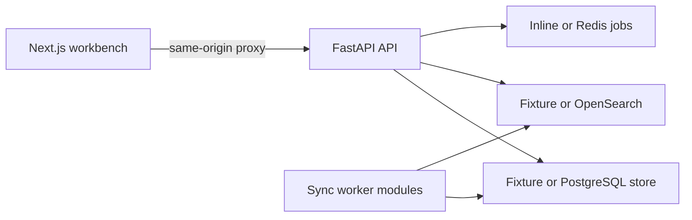

# Permission-Aware Internal Knowledge Assistant

Permission-aware internal search and Q&A for teams that need cited answers without leaking restricted, stale, deleted, or cross-tenant content.

## Project status

This repository contains a deterministic, fixture-backed demo. The local showcase proves the retrieval, citation, safe-denial, connector-status, and UI contracts. Live provider ACL fidelity, production identity, durable workers, performance, retention, and infrastructure remain deployment work.

## Architecture



## Included capabilities

- Permission-aware search and answer generation with source citations.
- Safe handling for denied, stale, deleted, unmapped, and cross-tenant records.
- Connector registry, sync-coordinator, readiness, and categorized failure states.
- Fixture web workbench with desktop/mobile showcase coverage.
- PostgreSQL migration and seed artifacts for the next deployment boundary.

## Quick start

Prerequisites: Python 3.11+, [`uv`](https://docs.astral.sh/uv/), Node.js/npm, and PowerShell.

```powershell
uv sync
npm --prefix apps/web ci
.\start-dev.ps1
```

The launcher starts the API at `http://127.0.0.1:8102` and the web workbench at `http://127.0.0.1:3102`. Open the web URL and ask:

> What is the travel reimbursement policy for my region and role?

For the containerized showcase:

```powershell
docker compose --profile fixture up --build
Invoke-RestMethod http://localhost:8102/health/ready
```

## Verification

```powershell
uv run pytest
npm --prefix apps/web run lint
npm --prefix apps/web run build
npm --prefix apps/web run test:showcase
```

Run the documentation contract first when changing the handoff:

```powershell
uv run pytest tests/acceptance/test_documentation_contract.py -q
```

## Project structure

```text
apps/api/       FastAPI routes, auth boundary, stores, and health checks
apps/web/       Next.js fixture workbench and browser tests
connectors/     Connector registry and sync contracts
workers/        Sync coordination and worker modules
db/             Migrations and demo seed artifacts
tests/          Contract, security, retrieval, and acceptance tests
```

## Configuration and safety

Fixture mode uses deterministic providers, an inline queue, and an in-memory store. Keep database URLs, model keys, queue credentials, connector credentials, and admin tokens server-side. Never commit `.env`, provider exports, or private keys. `X-Demo-Principal` is a fixture-only identity boundary and is not production authentication.

## Documentation

- [`DEMO_SCRIPT.md`](DEMO_SCRIPT.md) - showcase walkthrough and acceptance path.
- [`RUNBOOK.md`](RUNBOOK.md) - operational procedures.
- [`deployment.md`](deployment.md) - deployment responsibilities and production handoff.
- [`CONNECTOR_MATRIX.md`](CONNECTOR_MATRIX.md) - connector capability and verification status.

## Production boundary

Before live traffic, add server-authenticated identity and tenant authorization, durable PostgreSQL/search/job storage, ACL synchronization, signed connector callbacks, migrations, backups, observability, retention controls, and recovery tests. A passing fixture suite is not evidence of production authorization or provider parity.
